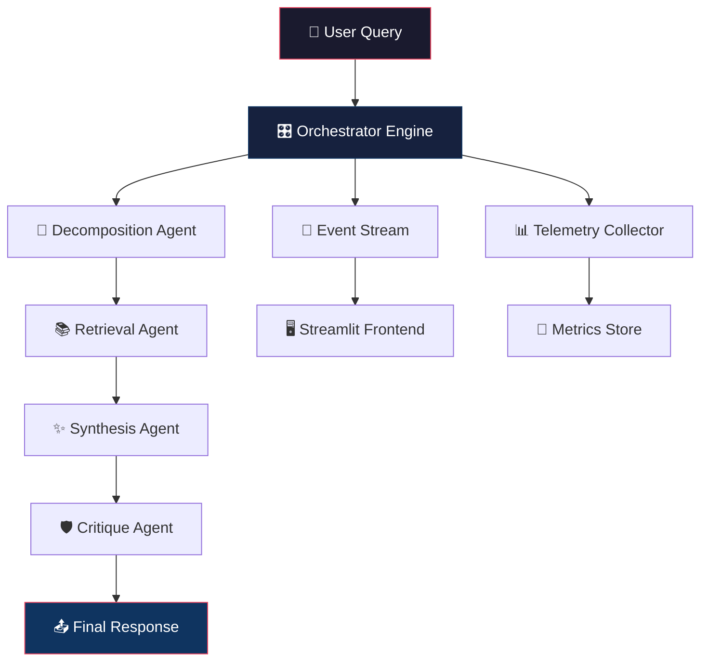
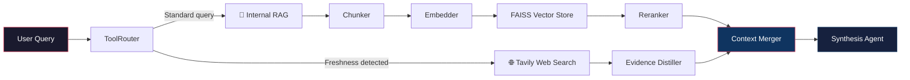
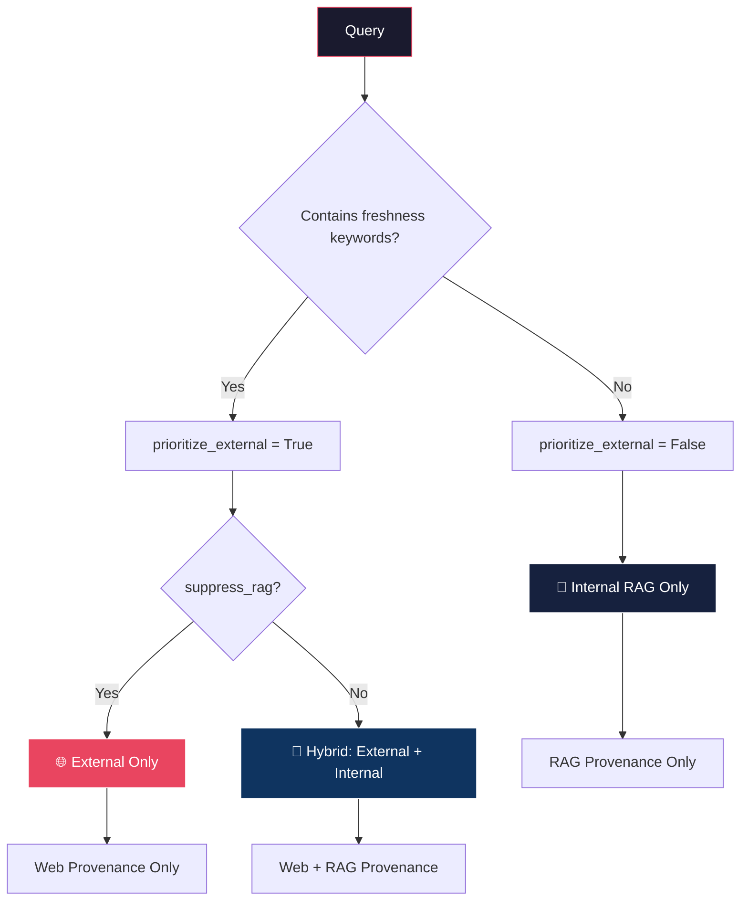

# 🪂 Mega AI Platform

> **Multi-Agent AI Orchestration System for Retrieval-Augmented Intelligence**

A production-style AI orchestration platform built with multi-agent workflows, semantic retrieval, live external intelligence, provenance tracking, critique systems, telemetry, and real-time streaming orchestration.

---

## 📌 Overview

This platform goes beyond traditional chatbot architectures by combining:

- 🧠 **Multi-agent reasoning** — Decomposition, Retrieval, Synthesis, Critique
- 📚 **Retrieval-Augmented Generation (RAG)** — FAISS + sentence-transformers
- 🌐 **Live web intelligence** — Tavily-powered external search
- 🔍 **Evidence grounding** — Provenance tracking for every claim
- ⚡ **Streaming orchestration** — Real-time SSE pipeline updates
- 🧭 **Context-aware retrieval routing** — Freshness detection + RAG suppression
- 📊 **Telemetry & observability** — Agent-level latency and token tracking
- 🛡️ **Critique-based self-evaluation** — Hallucination and grounding analysis

---

## 🏗️ System Architecture

### High-Level Flow



### Retrieval Pipeline



### Retrieval Routing Logic



---

## 📂 Project Structure

```
mega-ai/
│
├── app/
│   ├── agents/                    # Multi-agent system
│   │   ├── base.py                # Abstract base agent
│   │   ├── decomposition.py       # Query decomposition agent
│   │   ├── retrieval.py           # Hybrid retrieval agent
│   │   ├── synthesis.py           # Evidence synthesis agent
│   │   ├── critique.py            # Grounding & hallucination critique
│   │   └── registry.py            # Agent registry
│   │
│   ├── api/                       # FastAPI application
│   │   ├── main.py                # App entrypoint
│   │   ├── v1/
│   │   │   └── api.py             # Router aggregation
│   │   └── routes/
│   │       ├── orchestrator.py    # POST /orchestrate
│   │       ├── stream.py          # GET /stream (SSE)
│   │       ├── metrics.py         # GET /metrics
│   │       ├── health.py          # GET /health
│   │       ├── query.py           # POST /query (Celery)
│   │       └── context.py         # GET /context
│   │
│   ├── config/                    # Application configuration
│   │   └── settings.py            # Pydantic settings (.env loader)
│   │
│   ├── db/                        # Database layer
│   │   ├── base.py                # SQLAlchemy base
│   │   ├── models.py              # DB models
│   │   ├── session.py             # Session factory
│   │   └── init_db.py             # Database initialization
│   │
│   ├── evaluation/                # Benchmarking & evaluation
│   │   ├── benchmark_dataset.json # Test queries & expected keywords
│   │   ├── evaluator.py           # Single query evaluator
│   │   ├── metrics.py             # Keyword match & groundedness scoring
│   │   ├── runner.py              # Batch evaluation runner
│   │   └── reports/
│   │       └── eval_report.json   # Generated evaluation results
│   │
│   ├── frontend/                  # Streamlit dashboard
│   │   └── streamlit_app.py       # Real-time orchestration UI
│   │
│   ├── llm/                       # LLM integration layer
│   │   ├── client.py              # OpenRouter client + JSON cleaning
│   │   ├── prompts.py             # Agent prompt templates
│   │   └── schemas.py             # Pydantic response schemas
│   │
│   ├── memory/                    # Context & conversation memory
│   │   ├── context.py             # SharedContext (orchestration state)
│   │   ├── models.py              # AgentOutput, ProvenanceEntry, etc.
│   │   ├── enums.py               # JobStatus, AgentType, ToolStatus
│   │   ├── memory_manager.py      # Session history management
│   │   ├── conversation_store.py  # JSON-based conversation persistence
│   │   ├── summarizer.py          # LLM-powered conversation summarizer
│   │   └── conversations.json     # Persisted conversation data
│   │
│   ├── observability/             # Telemetry & monitoring
│   │   ├── events.py              # Event type definitions
│   │   ├── logger.py              # Structured event logger
│   │   ├── schemas.py             # LogEvent schema
│   │   ├── telemetry.py           # TelemetryCollector (latency/tokens)
│   │   ├── metrics_store.py       # JSON metrics persistence
│   │   ├── dashboard.py           # Metrics retrieval API
│   │   └── metrics.json           # Persisted telemetry data
│   │
│   ├── orchestrator/              # Pipeline orchestration
│   │   ├── engine.py              # Orchestrator (runs pipeline)
│   │   ├── pipeline.py            # Pipeline step definitions
│   │   ├── state_manager.py       # Job status transitions
│   │   └── event_stream.py        # Queue-based event broadcasting
│   │
│   ├── rag/                       # Retrieval-Augmented Generation
│   │   ├── chunker.py             # Sentence-based overlap chunking
│   │   ├── embedder.py            # SentenceTransformer embeddings
│   │   ├── vector_store.py        # FAISS index wrapper
│   │   ├── retriever.py           # Document → chunks → search
│   │   ├── reranker.py            # Cosine similarity reranker
│   │   ├── distiller.py           # LLM-powered evidence compression
│   │   └── documents/
│   │       └── battery_report.txt # Sample knowledge document
│   │
│   ├── schemas/                   # Shared Pydantic schemas
│   │   ├── common.py              # Common response schemas
│   │   ├── health.py              # Health check schemas
│   │   └── query.py               # Query request/response schemas
│   │
│   ├── tools/                     # Tool execution framework
│   │   ├── base.py                # BaseTool interface
│   │   ├── web_search.py          # Tavily web search tool
│   │   ├── executor.py            # ToolExecutor dispatcher
│   │   ├── router.py              # ToolRouter (freshness detection)
│   │   └── registry.py            # Tool registry
│   │
│   └── workers/                   # Background task processing
│       ├── celery_app.py          # Celery app configuration
│       ├── tasks.py               # Celery task definitions
│       └── job_runner.py          # Job execution wrapper
│
├── tests/                         # Test files
├── .env.example                   # Environment variable template
├── .gitignore                     # Git ignore rules
├── requirements.txt               # Python dependencies
└── README.md
```

---

## 🧠 Agent Pipeline

| Step | Agent | Responsibility |
|------|-------|----------------|
| 1 | **Decomposition** | Breaks query into analysis objectives, retrieval goals, and comparison dimensions |
| 2 | **Retrieval** | Hybrid semantic search (internal RAG + external Tavily), reranking, distillation |
| 3 | **Synthesis** | Generates grounded final answer with key insights from retrieved evidence |
| 4 | **Critique** | Evaluates grounding, hallucination risks, and confidence of the synthesis |

---

## ⚙️ Tech Stack

| Layer | Technology |
|-------|-----------|
| **Backend API** | FastAPI |
| **Frontend** | Streamlit |
| **Vector Search** | FAISS |
| **Embeddings** | Sentence Transformers (`all-MiniLM-L6-v2`) |
| **LLM Routing** | OpenRouter (`gpt-4.1-mini`) |
| **Web Search** | Tavily (advanced search) |
| **Streaming** | SSE (Server-Sent Events) |
| **Observability** | Custom structured telemetry |
| **Background Tasks** | Celery + Redis |
| **Database** | PostgreSQL + SQLAlchemy |
| **Configuration** | Pydantic Settings + `.env` |
| **Language** | Python 3.11 |

---

## 🌐 Supported Query Types

| Query Type | Example | Retrieval Strategy |
|-----------|---------|-------------------|
| **Internal Knowledge** | `Compare Tesla and BYD battery strategy` | RAG only |
| **Freshness** | `Latest Tesla battery innovations` | External only (RAG suppressed) |
| **Hybrid Intelligence** | `How has Tesla's battery strategy evolved?` | External + Internal |
| **Analytical** | `Analyze global EV battery market evolution` | External-prioritized hybrid |

---

## 🛠️ Installation & Setup

### 1. Clone & Setup

```bash
git clone <your-repo-url>
cd mega-ai
python3.11 -m venv venv
source venv/bin/activate
pip install -r requirements.txt
```

### 2. Configure Environment

```bash
cp .env.example .env
# Edit .env with your keys:
```

```env
OPENROUTER_API_KEY=your_openrouter_key
TAVILY_API_KEY=your_tavily_key
DATABASE_URL=postgresql://localhost/mega_ai
REDIS_URL=redis://localhost:6379/0
```

### 3. Start Services

```bash
# Terminal 1 — Backend API
uvicorn app.api.main:app --reload

# Terminal 2 — Celery Worker (optional, for background tasks)
celery -A app.workers.celery_app.celery_app worker --loglevel=info

# Terminal 3 — Streamlit Frontend
streamlit run app/frontend/streamlit_app.py
```

### 4. Access

| Service | URL |
|---------|-----|
| **Streamlit UI** | http://localhost:8501 |
| **Swagger Docs** | http://127.0.0.1:8000/docs |
| **SSE Stream** | http://127.0.0.1:8000/stream?query=... |
| **Metrics API** | http://127.0.0.1:8000/metrics |

---

## 📡 API Endpoints

| Method | Endpoint | Description |
|--------|----------|-------------|
| `POST` | `/orchestrate?query=...` | Run full orchestration pipeline |
| `GET` | `/stream?query=...` | SSE streaming orchestration |
| `GET` | `/metrics` | Retrieve telemetry data |
| `GET` | `/health` | Health check |
| `POST` | `/query` | Submit async Celery job |
| `GET` | `/context` | Get shared context state |

---

## 📊 Streaming Orchestration UI

The Streamlit dashboard provides:

- **⚡ Live Orchestration Timeline** — Real-time agent execution progress
- **✨ Streaming Synthesis** — Word-by-word final answer rendering
- **🛡️ Critique Panel** — Grounding, hallucination, and confidence analysis
- **📚 Provenance Cards** — Source agent, evidence title, and reference URLs
- **📊 Telemetry Table** — Per-agent latency and token estimates

---

## 🧪 Evaluation Framework

Run the built-in benchmark suite:

```bash
python -m app.evaluation.runner
```

This evaluates orchestration against `benchmark_dataset.json` using:

- **Keyword Match Score** — Checks for expected keywords in synthesis output
- **Groundedness Score** — Measures overlap between synthesis and provenance evidence
- **Latency Tracking** — Per-query execution time

Results are saved to `app/evaluation/reports/eval_report.json`.

---

## 📈 Current Capabilities

| Capability | Status |
|-----------|--------|
| Multi-Agent Orchestration | ✅ |
| Semantic RAG (FAISS) | ✅ |
| External Intelligence (Tavily) | ✅ |
| SSE Streaming Execution | ✅ |
| Critique System | ✅ |
| Provenance Tracking | ✅ |
| Web Source Provenance | ✅ |
| Telemetry & Observability | ✅ |
| Hybrid Retrieval Routing | ✅ |
| RAG Suppression | ✅ |
| Evidence Distillation | ✅ |
| Conversation Memory | ✅ |
| Memory Summarization | ✅ |
| Evaluation Benchmarks | ✅ |

---

## 🚧 Current Limitations

- FAISS is in-memory only (no persistent vector database)
- Token-level LLM streaming not implemented (frontend simulates word-by-word)
- Retrieval routing is keyword-heuristic based (no ML classifier)
- Limited long-term memory (JSON-based, not database-backed)
- No distributed orchestration (single-process pipeline)
- Evaluation framework is basic (no LLM-as-judge)

---

## 🔮 Future Improvements

| Area | Improvement |
|------|-------------|
| **Vector DB** | Migrate FAISS to Qdrant / Weaviate / ChromaDB for persistence |
| **Document Ingestion** | Support PDF, DOCX, URL uploads for custom knowledge |
| **Token Streaming** | True incremental LLM token streaming via SSE |
| **Query Routing** | Intent classification model replacing keyword heuristics |
| **Agent Planning** | LangGraph integration for graph-based orchestration |
| **Distributed Execution** | Async workers with queue-based agent dispatch |
| **Advanced Evaluation** | LLM-as-judge, retrieval precision, hallucination benchmarks |
| **Deployment** | Docker, Kubernetes, CI/CD, autoscaling |
| **Memory** | Episodic + semantic memory with user-specific retrieval |
| **Observability** | Orchestration DAG visualization, latency heatmaps |

---

## 🧩 Design Principles

- **Modularity** — Each agent is independent and replaceable
- **Explainability** — Every answer has traceable provenance
- **Grounded Reasoning** — Synthesis is always evidence-based
- **Orchestration Transparency** — Real-time pipeline visibility via streaming
- **Retrieval Quality** — Reranking + distillation + suppression ensures relevance
- **Production Patterns** — Settings management, structured logging, telemetry

---

## 📜 License

This project is for educational and demonstration purposes.